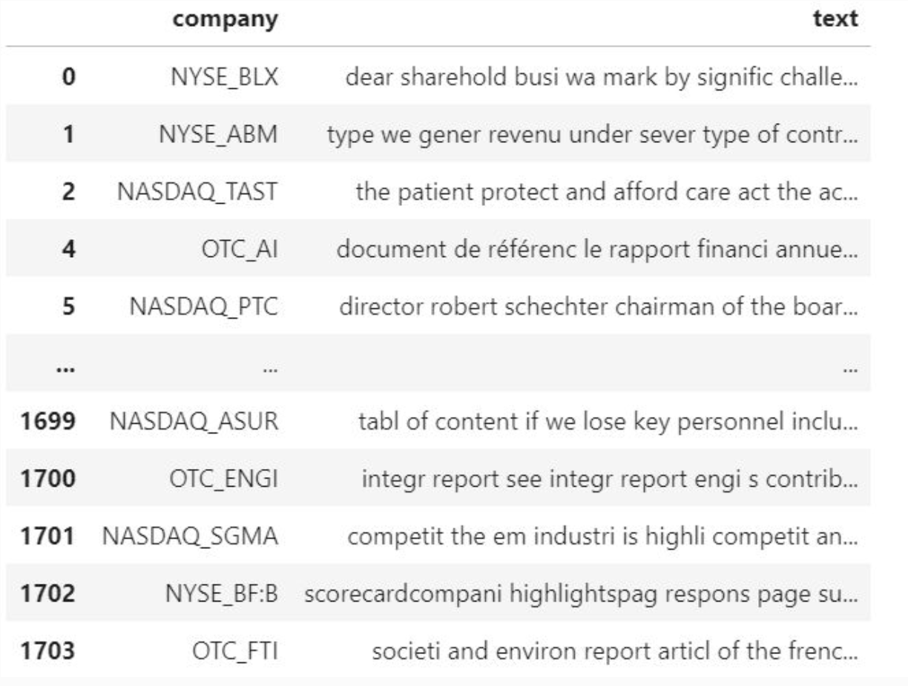
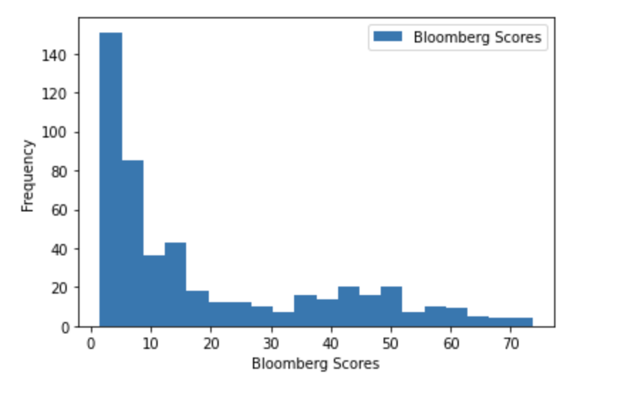

# NLP-EIP-Project-Python
The European Investment Bank (EIP) is a collaborative project with a group of student and EIB industry profeesionals. The purpose is to quantify climate risk for different companies across the globe. Climate risk is increasingly becoming the most important risk metric when it comes to financial risk management domain. To achieve the goal of the project, the plan is to reconstruct Bloomberg environmental score which gives companies different scores lowest 0 and highest 100 based on their transparency on tackling environmental issues. To reconstruct Bloomberg scores, the plan is build a corpus that contains text data which is collected from companies’ annual and sustainability reports. From this corpus that we build, we can reconstruct Bloomberg environmental scores. 

Text data are collected from investor presentations and sustainability reports from companies listed on public markets. These data are cleaned by removing  stop words, punctuations and numbers for corpus construction as shown in figure 1.

The next step was to implemetn feature extraction techniques such as Linear Discriminat Analysis (LDA), Doc2Vec and skip-gram on the corpus for dimensionality reduction and to extract climate related context. 

The modeling part icludes fitting different models, linear regression, TextCNN and XGBoost. The linear regression model doesn’t fit this kind of data well as it performs poorly on the testing set with very large MSE. One of the reasons of poor performance of the linear regression model is that the outcome variable is bounded between 0 to 70 as shown in the frequency distribution of Bloomberg environmental scores in figure 2.
 

In comparison, the belwo table shows that Doc2vec+XGBoost has lower training MSE and skip-gram+TextCNN has lower testing MSE, so skip-gram+TextCNN is more robust to reproduce Bloomberg disclosure score.

| Model Type | Training MSE |  Testing MASE|
|-|-|-|
|Skip-gram + TextCNN model|38.1408| 158.1096 | 
|Doc2Vec + XGBoost model|2.133| 238.37 | 
|LDA+XGBoost model|2.82| 159.43 | 

The prject needs further improvements in three areas:
- Including more sources of climate risk relevant documents to build a more complete corpus for further NLP modelling and testing.
- Achieving totally automatic corpus construction process by better utilization of dynamic web scraping techniques.
- Trying out more ‘advanced’ models and techniques. 
